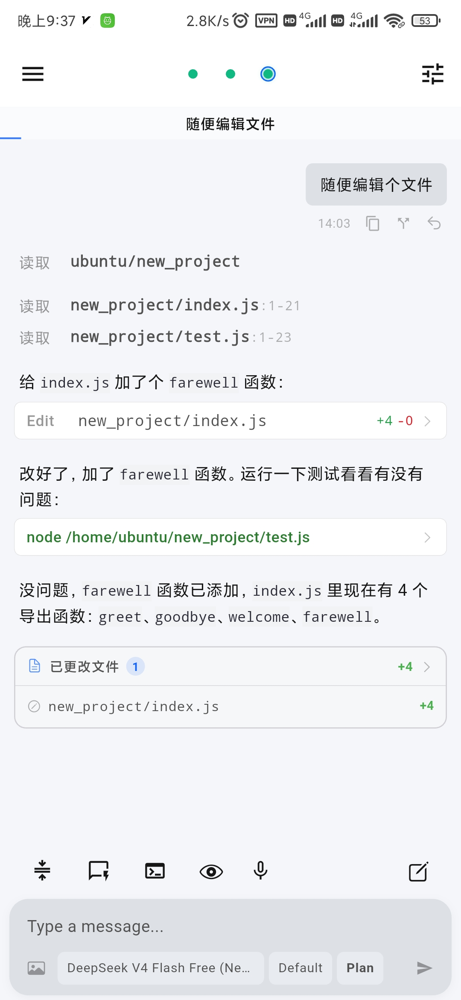
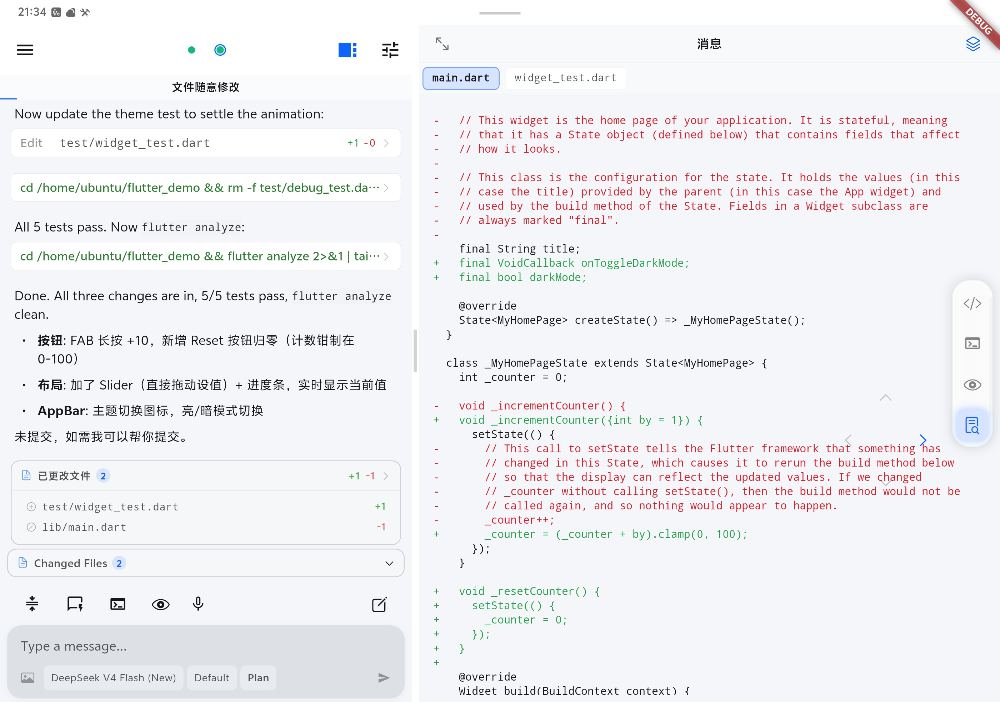

# OpenCode Mobile

  
  &nbsp;&nbsp;
  

  <a href="./README.md">English</a> | <b>简体中文</b>

> [!WARNING]
> **非官方项目 & 非生产级可用** — 本项目为 OpenCode 的**非官方**移动端客户端，目前仍处于积极开发和测试阶段。

---

## 📱 项目简介

**OpenCode Mobile** 是基于 **Flutter** 和 **Rust** 开发的 OpenCode **非官方**移动端客户端。

目前针对 Android 手机与平板设备进行了适配：
- **手机端**：简洁高效的单栏对话界面。
- **平板端**：基于 Row 实现的双栏分屏优化布局，更充分地利用大屏空间。

语音输入当前仅支持中、英、日、韩，是否添加更多支持取决于用户分布。

---
## 🚀 版本更新记录 (v0.9.9)

以下是最新的功能更新与问题修复：

1. **消息发送队列**：在 AI 正在生成回复时发送的消息将自动放入待发送区域，生成完成后自动发送。
2. **隐私增强**：日志和 UI 上均隐藏具体 IP 地址。
3. **内置浏览器**：浏览器标签页优先显示网页标题。

需求并不大，就不开源了，有bug的话还会修

### v0.9.8

1. **WebView 扩展**：支持点击预览按钮直接打开设置好的 IP+端口（长按可设置端口，可为每个项目绑定固定端口）。
2. **Terminal 页面**：仿 Termux 风格，支持键盘快捷键与自定义命令。
3. **图片识别模型**：支持设置图片识别模型，可以使用 OpenCode Zen 中的免费模型进行图片识别，识别内容将自动返回到输入框中。
4. **UI 优化**：若干界面细节调整与优化。

### v0.9.7

1. **Thinking Card 流式输出**：修复了此前 Thinking Card 流式输出被误禁用的问题。
2. **国际化补充**：补全并优化了应用内的多语言翻译。
3. **日志查看按钮**：在输入框上方新增临时日志按钮，方便直接查看与复制运行日志。
4. **连接页面修复**：修正了之前连接页面显示的错误 IP 地址。
5. **重连状态刷新**：优化了断线重连后的界面状态自动刷新机制。
6. **Subtask 自动滚动**：子任务列表支持随着状态更新自动滚动。

---

## 💬 问题反馈与说明

如果您在运行过程中遇到任何问题或有改进建议，欢迎提交 Issue！
