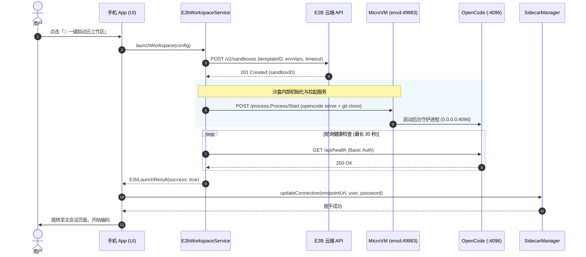
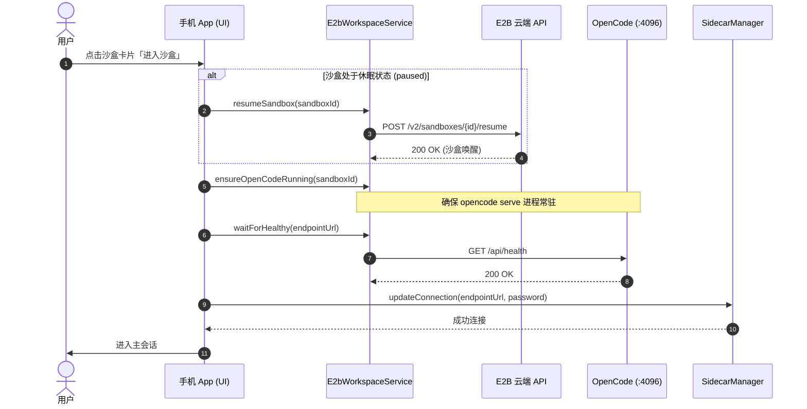
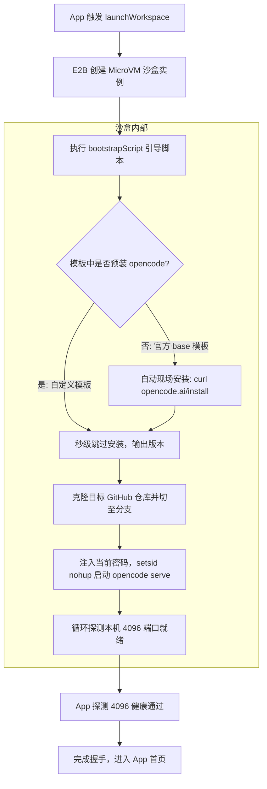

# E2B 云端工作区（Cloud Workspace）技术与功能架构文档

## 一、概述

E2B 云端工作区是客户端接入云端 MicroVM 沙盒的核心功能，允许用户在移动端直接创建、唤醒、管理并连接托管在 E2B 上的 OpenCode 开发环境，无需本地电脑开机即可进行全功能 AI 编程与终端交互。

---

## 二、系统架构与通信拓扑

```mermaid
flowchart TD
    subgraph Mobile [手机客户端 opencode_mobile]
        UI[连接页 / 云工作区面板]
        Svc[E2bWorkspaceService]
        Sidecar[SidecarManager]
    end

    subgraph E2B_Cloud [E2B 云端平台]
        API[E2B REST API: api.e2b.app]
        subgraph MicroVM [Firecracker MicroVM 沙盒]
            Envd[envd 守护进程 :49983]
            OpenCode[OpenCode Serve 服务 :4096]
            Workspace[/home/user/workspace Git 工作区]
        end
    end

    UI -->|配置与管理| Svc
    Svc -->|创建/唤醒/休眠/销毁/列表| API
    Svc -->|进程控制 Connect-RPC| Envd
    Sidecar -->|HTTP/SSE/PTY Basic Auth| OpenCode
```

### 关键端口与协议

| 端口 | 协议 / 格式 | 作用 | 访问域名格式 |
| :--- | :--- | :--- | :--- |
| **443** | HTTPS (REST JSON) | E2B 控制面 API（管理沙盒生命周期） | `https://api.e2b.app/v2/sandboxes` |
| **49983** | Connect-RPC (HTTP/2 / HTTP/1.1) | 沙盒内部 `envd` 守护进程，用于执行命令与进程管理 | `https://49983-{sandboxId}.e2b.app` |
| **4096** | HTTP 1.1 + SSE + WebSocket | `opencode serve` 服务端，提供 OpenAPI 接口与 PTY 终端 | `https://4096-{sandboxId}.e2b.app` |

---

## 三、功能模块清单

### 1. 云工作区配置 (`CloudWorkspaceConfig`)
* **E2B API 鉴权**：配置 `e2bApiKey`。
* **模板设置**：默认 `opencode`，支持用户自定义模板 ID。
* **Git 代码仓库集成**：
  * 支持 GitHub、GitLab、Gitee 及自建 Git 服务；
  * Token 鉴权（Personal Access Token），支持自动拉取私有仓库；
  * 支持分支选择（默认 `main` 或自定义）；
  * Git 提交身份设置（Author Name / Email）。
* **资源与生命周期控制**：
  * 沙盒超时时间（默认 1 小时，最长 24 小时，底层具备 400 自动降级 3600s 机制）；
  * 后台 TTL Keep-Alive 自动续期（每 5 分钟刷新一次）。
* **预装开发工具链**：Node.js、Python、Rust、Go、Flutter 开关标识。

### 2. 仓库选择器 (`GitRepoPickerSheet`)
* 支持根据 Token 实时读取用户的 GitHub 仓库列表（公开/私有、星标、语言、最后更新时间）；
* 实时搜索过滤；
* 选中仓库后自动拉取默认分支信息。

### 3. 一键启动云工作区 (`CloudWorkspaceLaunchDialog`)
* **参数前置校验**：API Key 必填检查；
* **沙盒创建**：调用 `POST /v2/sandboxes` 注入环境变量；
* **服务就绪保障**：
  * 通过内部通道在沙盒内拉起 `opencode serve --hostname 0.0.0.0 --port 4096`；
  * 自动在沙盒内检出/克隆指定的 Git 代码仓库至 `/home/user/workspace`；
  * 轮询 `/api/health` 端口健康状态；
* **全自动接入**：健康检查通过后直接调用 `SidecarManager.updateConnection` 并进入 App 首页。

### 4. 现有沙盒全生命周期管理 (`OpencodeConnectionPage`)
* **沙盒列表读取**：实时拉取用户 E2B 账户下的所有沙盒及其实时状态（运行中、已休眠、已终止）；
* **一键唤醒与进入**：
  * 休眠沙盒先调用 `POST /v2/sandboxes/{id}/resume` 唤醒；
  * 确认服务在 4096 端口在线后自动握手进入；
* **一键休眠（Pause）**：挂起沙盒以节省计算时长与费用；
* **一键销毁（Destroy）**：彻底删除释放沙盒资源；
* **当前活跃沙盒卡片**：展示当前已连接的沙盒 ID、状态、外网访问地址与最后连接时间。

---

## 四、核心交互时序图

### 1. 「一键启动云工作区」全流程



### 2. 「进入现有沙盒」流程



---

## 五、代码结构与文件索引

| 模块/层级 | 文件路径 | 职责说明 |
| :--- | :--- | :--- |
| **数据模型** | `lib/models/cloud_workspace_config.dart` | 云工作区用户偏好、Token、Git 仓库、活动沙盒持久化模型 |
| **数据模型** | `lib/models/e2b_sandbox_info.dart` | E2B 沙盒元数据解析（ID、模板、状态、创建时间、外网 URL） |
| **核心服务** | `lib/services/e2b_workspace_service.dart` | E2B REST/RPC 交互单例（创建、销毁、唤醒、休眠、列表、进程守护、健康轮询） |
| **Git 服务** | `lib/services/git_repo_service.dart` | GitHub 仓库读取、搜索、带鉴权 Clone URL 构建 |
| **连接界面** | `lib/pages/settings/opencode/connection_page.dart` | 直连 / 云端工作区双模式切换、沙盒列表展示与操作 |
| **Key 对话框** | `lib/pages/settings/opencode/e2b_api_key_dialog.dart` | 轻量级 E2B API Key 账户凭据输入对话框（解耦独立） |
| **配置底板** | `lib/pages/settings/opencode/cloud_workspace_sheet.dart` | 云工作区沙盒参数配置抽屉（模板、沙盒密码、Git 仓库、超时保活） |
| **启动弹窗** | `lib/pages/settings/opencode/cloud_workspace_launch_dialog.dart` | 一键启动进度弹窗动画与状态流转 |
| **仓库选择** | `lib/pages/settings/opencode/git_repo_picker_sheet.dart` | Git 仓库浏览与分支选择抽屉 |
| **多语言** | `lib/utils/translations.dart` | 云工作区中英文国际化文本字典 |
| **单元测试** | `test/services/e2b_workspace_service_test.dart` | 配置持久化、序列化、鉴权 URL、沙盒状态解析等 12 项测试 |

---

## 六、排查与容错规范

1. **凭证隔离与安全性**：
   * E2B API Key 仅在请求 E2B 官方接口时以 `X-API-Key` 携带，绝不对外暴露；
   * 沙盒服务密码由系统每次启动随机生成 24 位高强度字符串，仅注入 MicroVM 环境变量与客户端本地加密持久化；
   * Git Token 仅在沙盒内部通过 `git clone` 临时使用，不保留在公开 URL 中。
2. **健康检查与防挂死机制**：
   * 启动与连接均配置有超时与最大重试次数限制（15~20 次，每次间隔 2 秒）；
   * 超时未就绪会主动向用户给出明确的错误原因与排查提示，阻止 App 无限等待。

---

## 七、502 故障修复记录(2026-08-31)

### 现象

创建沙盒成功,但健康检查轮询 `https://4096-{sandboxId}.e2b.app/api/health` 持续返回
`HTTP 502 {"message":"The sandbox is running but port is not open","port":4096}`。
含义:沙盒 MicroVM 活着,但 4096 端口上没有任何进程在监听 —— 即
`opencode serve` 从未在沙盒内成功启动。

### 根因(共 4 处叠加)

1. **envd 地址是空壳**:`ConnectionConfig.getSandboxEnvdUrl` 无视 sandboxId 恒返回
   `https://sandbox.e2b.app`,命令未路由到目标沙箱。已改为直连域名路由
   `https://49983-{sandboxId}.{domain}`(与业务端口 `4096-{sandboxId}` 同一机制)。
2. **Connect-RPC 流式请求体未加信封帧**:`process.Process/Start` 是 server-streaming
   RPC,请求体必须是 `1 字节 flags + 4 字节大端长度 + JSON` 帧
   (Content-Type: `application/connect+json`);原实现发送裸 JSON 必被 400 拒绝。
   unary 方法则应为裸 JSON(`application/json`)。
3. **启动失败被静默吞掉**:`ensureOpenCodeRunning` 返回值在两处调用点均被丢弃,
   失败后照常进入健康轮询,表现为无限 502。
4. **缺少 opencode 安装兜底**:bootstrap 脚本只做 `which opencode` 检查,
   模板内没有 opencode 二进制时进程即退,端口永远打不开。

### 修复与新增能力

| 项 | 说明 |
|---|---|
| envd 直连域名 | `getSandboxEnvdUrl(sandboxId)` → `https://49983-{sandboxId}.{domain}`,支持 sandboxUrl 显式覆盖 |
| 信封帧协议 | `serverStreamCall` 请求体用 `encodeFrame` 编码;unary 用裸 JSON;修复 UTF-16 codeUnits 解帧损坏多字节字符 |
| envd 认证 | `X-Access-Token` 使用创建/连接响应签发的 `envdAccessToken`(已持久化到 `CloudWorkspaceConfig.activeSandboxEnvdToken`),API Key 仅兜底 |
| 安装兜底 | bootstrap 脚本内 `command -v opencode` 失败时先跑官方安装脚本 `curl -fsSL https://opencode.ai/install | bash`,再 `npm i -g opencode-ai` 兜底;退出码 42=安装失败、43=serve 启动失败 |
| 失败上抛 | `ensureOpenCodeRunning` 返回结构化 `E2bBootstrapResult`(成功/原因/`/tmp/opencode.log` 尾部),launch 与连接页检查失败即中止并展示 |
| 健康轮询 | 502=未就绪继续重试;401/403=密码不匹配立即失败;总窗口放宽至约 120 秒(60 次 × 2 秒) |
| 真实 connect | `Sandbox.connect` 真正调用 `POST /sandboxes/{id}/connect`(body `{timeout}`),自动唤醒 paused 沙盒(201)并刷新 envdAccessToken;404 明确报错 |
| TTL keep-alive | 新增 `Sandbox.setTimeout`(`POST /sandboxes/{id}/timeout`),连接成功后每 5 分钟续期,销毁/切回自建服务器时停止 |
| 密码恢复 | bootstrap 将密码落盘 `~/.opencode_pw`(chmod 600);重连密码未知时通过 envd 读取恢复,不再使用字面量 `'opencode'` 兜底 |
| background 语义 | `Commands.start(background: true)` 收到 start 事件(pid)即脱离事件流返回,进程由 envd 托管继续运行(对齐官方 JS SDK) |
| 错误映射 | envd 401/403 → `SandboxAuthenticationException`,404 → `SandboxNotFoundException`,5xx → `SandboxException` |

### 真机联调步骤

1. 在 [e2b.app](https://e2b.app) 获取 API Key(`e2b_` 前缀),App 设置 → 连接 → E2B 云端 → 配置中填入;
2. 模板 ID 可留空默认 `opencode`,或使用[自定义模板](e2b_template_guide.md)(秒级启动);
3. 点击「新建沙盒」,观察弹窗进度:申请沙盒 → 部署 OpenCode(首启需安装约 30~60 秒)→ 健康握手 → 进入工作区;
4. 若失败,弹窗会展示具体原因与沙盒内 `/tmp/opencode.log` 尾部;沙盒保留在列表中,可销毁或重连。

### 补充修复(2026-08-31 第二轮:状态展示与错误透出)

1. **云端模式专属状态条**:此前顶部状态条在云端模式也显示自建服务器连接状态
   (来自上次持久化的 `Global.serverUrl` 健康检查),导致未配置 Key 也显示"已连接"。
   现在云端模式显示自身状态:未配置 Key / 未连接 / 已连接(实时探测)/ 服务未就绪(502)/ 认证未通过(401)。
2. **控制面错误透出**:`Sandbox.create/list/pause/resume/kill/setTimeout` 均改为
   `validateStatus: true` + 解析 E2B 错误体 `{code,message}`,不再被 Dio 通用异常文案
   吞掉真实原因(如 "Template not found"、"Invalid API key");401/403 → "API Key 无效",
   message 含 template → 附加"检查模板 ID"指引。
3. **"当前连接"徽标收紧**:仅当 `Global.serverUrl` 真实包含该沙盒 ID 时才标记,
   不再仅凭持久化的 `activeSandboxId`。
4. **启动弹窗前置校验**:Key 为空直接报错,不发起任何请求。

### 补充修复(2026-08-31 第三轮:bootstrap 自匹配导致 serve 未启动)

**现象**:沙盒 RUNNING、`opencode --version` 正常输出,但 4096 端口始终 502,
bootstrap 却报成功。

**根因**:bootstrap 脚本经 `bash -l -c '<全文>'` 执行,**进程自身 cmdline 包含脚本全文**,
开头的 `pgrep -f "opencode serve"` 匹配到了脚本自己,误判"已在运行"直接 `exit 0`,
serve 从未被拉起。`recoverPassword` 存在同款自匹配。

**修复**:
* 服务就绪判定全部改为 **curl 探测本机 `127.0.0.1:4096/api/health`**(带密码),
  三态:200=健康跳过 / 000=无监听需启动 / 其他=有服务但密码不匹配,kill 后带正确密码重启;
* `pgrep`/`pkill` 一律使用 `[o]pencode serve` 正则写法规避自匹配;
* 启动后从「固定 sleep 2 检查一次」改为**轮询等待端口就绪(最多约 30 秒)**,
  进程中途退出立即 `exit 43` 并输出 `/tmp/opencode.log`;
* serve 以 `setsid nohup` 脱离会话启动;密码落盘 `~/.opencode_pw` 移至脚本最前。

### 补充更新(2026-08-31 第四轮:双后端架构、连接下沉与冷启动唤醒)

1. **共享连接流程下沉 (`connectSandbox`)**：
   * 将「Sandbox.connect 自动唤醒 → 密码解析恢复 → ensureOpenCodeRunning 部署保障 → waitForHealthy 健康验证」四步收拢至 `E2bWorkspaceService.connectSandbox`，消除 `SplashPage` 与 `OpencodeConnectionPage` 间的重复逻辑。
2. **SplashPage 双登录与 4s 快速探测**：
   * 顶部引入 `SegmentedButton` 自由切换自建与云端模式；
   * 云端冷启动采用 4 秒快速探测，命中 200 直接进入主页并开启 keep-alive；未就绪停留在面板引导用户一键唤醒并连接，杜绝盲目轮询与误计费。
3. **会话与抽屉后端统一标识**：
   * 通过 `E2bWorkspaceService.isCloudUrl` 统一判定；
   * 左抽屉项目列表及右抽屉会话列表展示对应的云朵 / 自建服务器图标，设置中心 Connection Hub 项增加动态副标题展示当前后端信息。
4. **自建与云端配置彻底隔离**：
   * 在 `AppSettingsStore` 新增 `self_hosted_server_*` 独立字段，`Global.persistServerConnection` 仅在自建连接时同步更新，连接沙盒绝不覆盖自建服务器 IP 与密码。
5. **项目列表跨端清理与弹窗响应式刷新**：
   * `ProjectController.refreshAfterConnect` 清理旧内存；`fetchProjects` 移除跨端 `localOnly` 幽灵项目合并，严格展示当前后端的真实项目；
   * `CloudWorkspaceSheet` 保存 Key 流程改为异步落盘，退出后立即触发连接页 `setState` 与 `_fetchSandboxList`。

---

## 八、E2B 模板与 OpenCode 服务的权责架构

在使用 E2B 云端沙盒时，许多开发者容易混淆「E2B 模板」与「OpenCode 服务」的边界与职责。本节明确说明两者的协作机制。

### 1. 概念边界与协作分工

| 维度 | E2B 模板 (Template) | OpenCode 服务 (opencode serve) |
| :--- | :--- | :--- |
| **本质属性** | 底层 Linux 虚拟机的**静态只读快照 / 镜像** | 运行在虚拟机内的**动态应用守护进程** |
| **部署主体** | E2B 平台托管（官方提供或用户通过 CLI 自定义构建） | **由客户端 App 引导脚本（Bootstrap Script）自动拉起** |
| **负责内容** | 操作系统发行版（Ubuntu）、系统库、预装运行时（Node.js/Python/Rust/Docker） | 监听 `4096` 端口、Basic Auth 鉴权、提供 OpenAPI、处理 PTY 终端会话 |
| **动态变量** | **无**（完全静态，所有沙盒实例共享同一个母体快照） | **高度动态**：每次沙盒生成不同的随机密码、绑定不同的 GitHub 代码仓库 |

### 2. 为什么服务不能直接在模板做镜像时开机自启？

1. **密码动态性**：沙盒访问密码出于安全考虑是随机生成的（或用户在 App 端临时指定），模板快照制作时不可能预知未来的连接密码；
2. **代码上下文动态性**：每个沙盒要打开的 GitHub 仓库与分支不同，`opencode serve` 必须在目标项目克隆完成后的**项目根目录**下执行，OpenCode 才能识别该项目的上下文与文件树。

### 3. 两种模板类型下的启动流转



* **选用官方模板（如 `base`）**：引导脚本检测到系统中没有 `opencode` 命令，会自动执行 `curl -fsSL https://opencode.ai/install | bash` 进行自动化现场安装（相当于 App 帮你完成部署），然后再启动服务。首次启动需约 30~60 秒。
* **选用自定义模板（如 `opencode`）**：若开发者按照 [自定义模板指南](e2b_template_guide.md) 提前将 `opencode` 固化进镜像，脚本检查到二进制存在即秒级跳过安装，直接拉取代码并起服务，启动时间缩减至约 5 秒。

---

## 九、补充修复(2026-09-01 第五轮:交互架构解耦与自杀Bug修复)

### 1. 交互重构：API Key 与沙盒配置彻底解耦 (`E2bApiKeyDialog`)

#### 问题背景
此前 `CloudWorkspaceSheet` 将「E2B API Key」和「新建沙盒表单（模板、密码、Git 仓库、TTL）」塞在同一个抽屉中。导致：
* 首次使用时，无 Key 状态弹出配置抽屉，用户保存 Key 后回到页面，竟然还要再点击一次「新建沙盒」打开同一个抽屉填参数，流程割裂多余；
* E2B API Key 是**全局/账户级**凭证，所有沙盒共享同一个 Key 池；而模板、Git、TTL 是**沙盒级**参数，两者生命周期完全不同。

#### 方案改动
1. **独立轻量弹窗**：新增 `E2bApiKeyDialog`，仅包含单个 Key 输入框，用于输入和清空 Key，保存直接写库不阻塞；
2. **沙盒表单瘦身**：`CloudWorkspaceSheet` 彻底移除 API Key 输入框，内部直接从 `Global.settings` 静默透传 Key，专注于沙盒参数；
3. **无 Key 场景统一引导**：Splash 页与连接页在未配置 Key 时，统一唤起 `E2bApiKeyDialog`，填好后刷新状态直接切到沙盒列表/新建页；
4. **有 Key 状态便捷修改**：连接页健康状态栏右侧新增钥匙图标，点击随时可换 Key。

---

### 2. 启动脚本自身被 pkill 误杀故障修复

#### 故障现象
新建沙盒时，日志打印出 `=== OpenCode Bootstrap ===` 和 `USER: user, HOME: /home/user` 后彻底停滞，等待 30 秒后报服务超时失败。

#### 故障根因
此前优化代码时，将探测分支简化为了无条件的：
```bash
pkill -f "[o]pencode serve" 2>/dev/null || true
```
因为通过 E2B RPC 执行命令是走 `/bin/bash -l -c "<完整脚本字符串>"`，**当前运行的 bash 进程自身的 cmdline 中就包含了整个脚本的字符串**（后文恰好有 `opencode serve --hostname ...`）。
`pkill -f` 匹配的是进程的**完整命令行**，导致其匹配到了正在执行脚本的 bash 父进程自身，脚本刚打印完两行 log 就被自身发出的信号直接杀死，后续安装、克隆与启动服务均无法执行。

#### 修复方案
1. **新建沙盒（000）绝不 kill**：恢复 `probe` 三态分支，新建沙盒端口无监听（`000`）时明确判定为正常冷启动，不执行任何 kill 语句，直接跳过；
2. **精确匹配二进制进程名**：对于确需杀死旧服务的异常分支（401/403 密码不匹配），改用：
   ```bash
   pkill -x opencode 2>/dev/null || true
   ```
   `-x` 仅匹配 `comm` 名字为 `opencode` 的真正二进制程序，绝不会波及名为 `bash` 的脚本进程，彻底杜绝自杀。

---

## 十、补充演进(2026-09-01 第六轮: 左抽屉多后端扁平化、超时400动态降级与工作区弹窗现代重构)

### 1. 左抽屉多后端分组与项目扁平化 (`LeftDrawerBody` / `left_panel_content.dart`)
* **双分组并存**：左侧抽屉同时平铺展示「🖥️ 自建服务器」与「☁️ E2B 云端沙盒」两大分组，当前连接的后端通过绿色圆点 `●` 高亮指示；
* **沙盒项目纯粹平铺**：移除了中间层繁琐的沙盒 ID 嵌套容器与卡片框线，将当前沙盒内的 OpenCode 项目及其他可用沙盒（带项目名/ID兜底）直接平铺展示，点击任意项目即可一键触发沙盒自动切换与会话连接；
* **极简排版**：移除了所有多余的分割线与路径副标题，项目仅保留纯粹的名称；
* **全局隐藏项目沉底**：隐藏项目卡片独立沉底于抽屉最下方，不污染特定后端的列表状态。

### 2. E2B 超时动态降级机制（Timeout Dynamic Fallback）
* **背景**：E2B 平台对于免费 Hobby 计划强制要求单次超时时间 $\le 3600\text{s}$（1 小时），传入大于 3600s（如 2h/4h/24h）会直接返回 `HTTP 400 {"code": 400, "message": "timeout must be less than or equal to 3600"}`；而付费 Pro 计划支持最长 24 小时（86400s）；
* **SDK 自动容错**：在 `Sandbox.create`、`Sandbox.connect`、`Sandbox.setTimeout` 三个核心入口处，统一捕获 400 timeout 错误，自动以 `3600s` 降级重试；
* **长会话 Keep-Alive**：解除定时器内部的 3600s 硬编码截断，支持最高 86400s 续期，让 Pro 账户尽享 24 小时长活跃会话，Hobby 账户自动降级。

### 3. 新建沙盒工作区弹窗 (`CloudWorkspaceSheet`) 现代重构
* **移除冗余 `Scaffold` 与 `DraggableScrollableSheet`**：改为 Material 3 标准规范的 `showDragHandle: true` 结合 `SafeArea` + `ConstrainedBox` + `Flexible(ListView)`；
* **去除虚假功能**：移除无法由云端自动触发的 `autoPause` 开关，保活配置纯粹聚焦于真实生效的 TTL；
* **默认时长优化**：构造函数默认值修正为 `1h`（`CloudWorkspaceConfig.ttlHours = 1`），贴合主流配置；
* **常驻底部操作按钮**：操作按钮（`创建并拉起工作区` / `保存`）移出 `ListView` 并固定常驻在视口最底部，表单支持 `shrinkWrap: true` 紧凑包裹，彻底消除多余留白。

