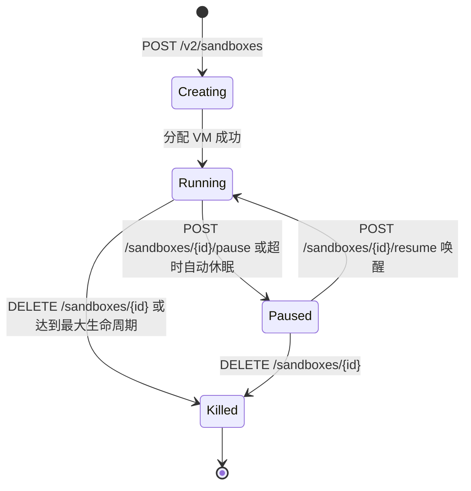

# E2B Dart SDK 架构与技术实现全景规范文档 (E2B Dart SDK Specification)

> 本文档为 E2B 官方 SDK（JavaScript/TypeScript 及 Python 原生实现）的完整 Dart 复刻与架构工程规范。涵盖控制面 REST API、MicroVM 数据面 Connect-RPC 通信协议、PTY 终端流式转发、文件系统分块与签名校验、Git 自动化封装及 Sandbox 生命周期完整状态机。

---

## 目录
1. [一、系统设计哲学与双平面架构](#一系统设计哲学与双平面架构)
2. [二、底层通信协议规范 (Wire Protocol Specification)](#二底层通信协议规范-wire-protocol-specification)
   - [1. Connect-RPC 帧封包与解包协议](#1-connect-rpc-帧封包与解包协议)
   - [2. 路由寻址与必需 HTTP Header](#2-路由寻址与必需-http-header)
3. [三、数据面核心 RPC 服务规范](#三数据面核心-rpc-服务规范)
   - [1. 进程子系统 (process.Process)](#1-进程子系统-processprocess)
   - [2. 伪终端子系统 (process.PTY)](#2-伪终端子系统-processpty)
   - [3. 文件子系统 (filesystem.Filesystem)](#3-文件子系统-filesystemfilesystem)
   - [4. URL 签名算法 (Signature Engine)](#4-url-签名算法-signature-engine)
4. [四、控制面 REST API 规范 (api.e2b.app/v2)](#四控制面-rest-api-规范-apie2bappv2)
   - [1. 沙盒创建与环境注入](#1-沙盒创建与环境注入)
   - [2. 状态机流转 (Running / Paused / Killed)](#2-状态机流转-running--paused--killed)
   - [3. 端口映射 (getHost) 与健康监测](#3-端口映射-gethost-与健康监测)
5. [五、Dart SDK 模块架构与类型定义](#五dart-sdk-模块架构与类型定义)
   - [1. 包目录结构](#1-包目录结构)
   - [2. 核心类与接口设计](#2-核心类与接口设计)
6. [六、高级场景与最佳实践](#六高级场景与最佳实践)
   - [1. AI 编程沙盒一键初始化与 Git 工作区同步](#1-ai-编程沙盒一键初始化与-git-工作区同步)
   - [2. 长连接保活与异常熔断](#2-长连接保活与异常熔断)

---

## 一、系统设计哲学与双平面架构

E2B 采用严格的**控制面 (Control Plane)** 与 **数据面 (Data Plane)** 解耦架构：

```mermaid
flowchart TD
    subgraph Client [Dart E2B SDK (opencode_mobile)]
        SandboxClass[Sandbox 门面类]
        CmdService[Commands 模块]
        PtyService[Pty 模块]
        FsService[Filesystem 模块]
        GitService[Git 模块]
        ConnectRPC[Connect-RPC 帧编解码引擎]
        HttpTransport[Dio / HTTP2 Transport]
    end

    subgraph ControlPlane [控制面: https://api.e2b.app/v2]
        CreateAPI[沙盒创建 /sandboxes]
        ListAPI[沙盒列表 /sandboxes]
        PauseAPI[沙盒休眠 /pause]
        ResumeAPI[沙盒唤醒 /resume]
        KillAPI[沙盒销毁 DELETE]
    end

    subgraph DataPlane [数据面: MicroVM envd:49983]
        EnvdDaemon[envd 守护进程]
        ProcService[process.Process]
        FileService[filesystem.Filesystem]
    end

    subgraph EdgeRouting [边缘网关: *.e2b.app]
        IngressProxy[Edge Ingress Proxy]
        AppPort[应用端口例如 :4096]
    end

    SandboxClass -->|控制生命周期| ControlPlane
    CmdService & PtyService & FsService --> ConnectRPC
    ConnectRPC --> HttpTransport
    HttpTransport -->|49983 Connect-RPC| EnvdDaemon
    EnvdDaemon --> ProcService & FileService
    IngressProxy -->|透明端口转发| AppPort
```

### 核心特性
1. **轻量与隔离**：基于 Firecracker MicroVM，每个沙盒具有独立的 Linux 内核、文件系统和虚拟网络接口；
2. **状态快照 (Snapshot)**：沙盒休眠时（`pause`）将内存状态保存为快照，唤醒（`resume`）时秒级恢复；
3. **安全凭证分级**：
   - `apiKey`：控制面管理令牌；
   - `envdAccessToken`：数据面 MicroVM 会话专属鉴权令牌；
   - `signature`：特定文件临时读写的基于 SHA-256 签名。

---

## 二、底层通信协议规范 (Wire Protocol Specification)

### 1. Connect-RPC 帧封包与解包协议

E2B 的 `envd` 服务（端口 49983）使用 Connect-RPC 协议标准。每次流式调用返回由一系列 5 字节定长帧头 + 变长 Payload 构成的连续字节流：

```text
+-----------------+---------------------------------+--------------------------+
| 1 Byte (Flag)   | 4 Bytes (Big-Endian Length L)  | L Bytes (Payload JSON)   |
+-----------------+---------------------------------+--------------------------+
```

* **Flag 标志位**：
  * `0x00` (Data Message Frame)：数据帧，Payload 为 JSON 序列化的事件对象；
  * `0x02` (End-of-Stream Trailer Frame)：流结束尾帧，Payload 包含错误或元数据。
* **Length 长度**：
  * `(b[1] << 24) | (b[2] << 16) | (b[3] << 8) | b[4]`，表示紧随其后的 JSON 字节长度。

### 2. 路由寻址与必需 HTTP Header

向沙盒数据面发起请求时，必须包含以下标准化头部：

| Header 名称 | 示例值 | 说明 |
| :--- | :--- | :--- |
| `Connect-Protocol-Version` | `1` | 声明使用 Connect-RPC 协议版本 1 |
| `Content-Type` | `application/connect+json` | 报文格式为 Connect JSON |
| `E2b-Sandbox-Id` | `izz06i52v927k3g5dy73o` | 目标沙盒 ID，供边缘网关路由 |
| `E2b-Sandbox-Port` | `49983` | 内部 envd 端口 |
| `X-Access-Token` | `envd_token_***` | 沙盒专属访问令牌 |
| `X-API-Key` | `e2b_***` | 用户 API Key（兜底凭证） |
| `Keepalive-Ping-Interval` | `50` | 保持长连接心跳周期（秒） |

---

## 三、数据面核心 RPC 服务规范

### 1. 进程子系统 (`process.Process`)

服务路径：`/process.Process/{Method}`

#### (1) `Start` (Server Streaming)
* **端点**：`POST /process.Process/Start`
* **请求体 (`StartRequest`)**：
  ```json
  {
    "process": {
      "cmd": "/bin/bash",
      "args": ["-l", "-c", "command_to_run"],
      "envs": { "ENV_VAR": "val" },
      "cwd": "/home/user"
    },
    "pty": null,
    "stdin": false
  }
  ```
* **响应帧事件 (`ProcessEvent`)**：
  - `start`：`{ "pid": 1234 }`
  - `data`：`{ "stdout": "<base64>", "stderr": "<base64>" }`
  - `end`：`{ "exit_code": 0, "exited": true, "error": "" }`

#### (2) `SendInput` (Unary)
* **端点**：`POST /process.Process/SendInput`
* **请求体**：
  ```json
  {
    "process": { "pid": 1234 },
    "input": { "stdin": "<base64_data>" }
  }
  ```

#### (3) `SendSignal` (Unary)
* **端点**：`POST /process.Process/SendSignal`
* **请求体**：
  ```json
  {
    "process": { "pid": 1234 },
    "signal": 15
  }
  ```
  *(15 = `SIGTERM`, 9 = `SIGKILL`)*

#### (4) `CloseStdin` (Unary)
* **端点**：`POST /process.Process/CloseStdin`
* 用于向非 PTY 进程发送 EOF 关闭标准输入。

---

### 2. 伪终端子系统 (`process.PTY`)

与普通进程类似，但在 `StartRequest` 中注入 `pty` 参数：
```json
{
  "process": {
    "cmd": "/bin/bash",
    "args": ["-l"],
    "envs": { "TERM": "xterm-256color" }
  },
  "pty": {
    "size": { "cols": 120, "rows": 40 }
  }
}
```
* 终端输出通过 `DataEvent.pty`（Base64 编码的 ANSI 字符序列）下发；
* 终端尺寸调整调用 `POST /process.Process/Update`：
  ```json
  {
    "process": { "pid": 1234 },
    "pty": { "size": { "cols": 140, "rows": 50 } }
  }
  ```

---

### 3. 文件子系统 (`filesystem.Filesystem`)

* **文件读取**：`POST /filesystem.Filesystem/Read`（支持文本与二进制流）；
* **文件写入**：`POST /filesystem.Filesystem/Write`；
* **目录列出**：`POST /filesystem.Filesystem/List`；
* **目录监视**：`POST /filesystem.Filesystem/WatchDir`（Server Streaming 实时回传文件增删改事件）。

---

### 4. URL 签名算法 (Signature Engine)

用于生成无需携带 Header 即可安全直连下载/上传沙盒文件的临时 URL：

```dart
String generateSignature({
  required String path,
  required String operation, // 'read' | 'write'
  required String user,
  required String envdAccessToken,
  int? expirationInSeconds,
}) {
  final expiration = expirationInSeconds != null
      ? (DateTime.now().millisecondsSinceEpoch ~/ 1000) + expirationInSeconds
      : null;
      
  final raw = expiration == null
      ? '$path:$operation:$user:$envdAccessToken'
      : '$path:$operation:$user:$envdAccessToken:$expiration';

  final bytes = utf8.encode(raw);
  final digest = sha256.convert(bytes);
  final base64Hash = base64Url.encode(digest.bytes).replaceAll('=', '');
  return 'v1_$base64Hash';
}
```

---

## 四、控制面 REST API 规范 (`api.e2b.app/v2`)

### 1. 沙盒创建 (`POST /v2/sandboxes`)
```json
{
  "templateID": "opencode",
  "timeout": 1800,
  "autoPause": true,
  "envVars": {
    "OPENCODE_SERVER_PASSWORD": "...",
    "PORT": "4096"
  },
  "metadata": {
    "source": "opencode_mobile"
  }
}
```

### 2. 状态机模型



### 3. 端口映射 (`getHost`) 与网关行为
* **服务 URL**：`https://{port}-{sandboxId}.e2b.app`
* **网关透明转发**：边缘网关根据主机名解析出 `sandboxId` 和 `port`，直接转发至对应 MicroVM 的该端口；
* **健康检查标准**：向 `https://4096-{sandboxId}.e2b.app/api/health` 发起 GET 请求（带 Basic Auth），返回 200 即证明底层网络与应用层全部打通。

---

## 五、Dart SDK 目录架构

```text
lib/e2b/
├── e2b.dart                         # 主导出入口
├── sandbox.dart                     # Sandbox 核心顶层类
├── models/
│   ├── sandbox_opts.dart            # 创建与连接配置选项
│   ├── process_models.dart          # 进程、结果、Handle、事件模型
│   ├── filesystem_models.dart       # 文件与目录元数据模型
│   └── pty_models.dart              # 终端尺寸与按键事件
├── transport/
│   ├── connection_config.dart       # URL 解析与 Header 注入
│   ├── connect_transport.dart       # Connect-RPC 帧解包与流处理
│   └── signature.dart               # SHA-256 签名生成引擎
└── services/
    ├── commands.dart                # 命令执行器 (run, start, kill)
    ├── filesystem.dart              # 文件系统 API
    ├── pty.dart                     # 终端交互 API
    └── git.dart                     # Git 高阶封装
```
