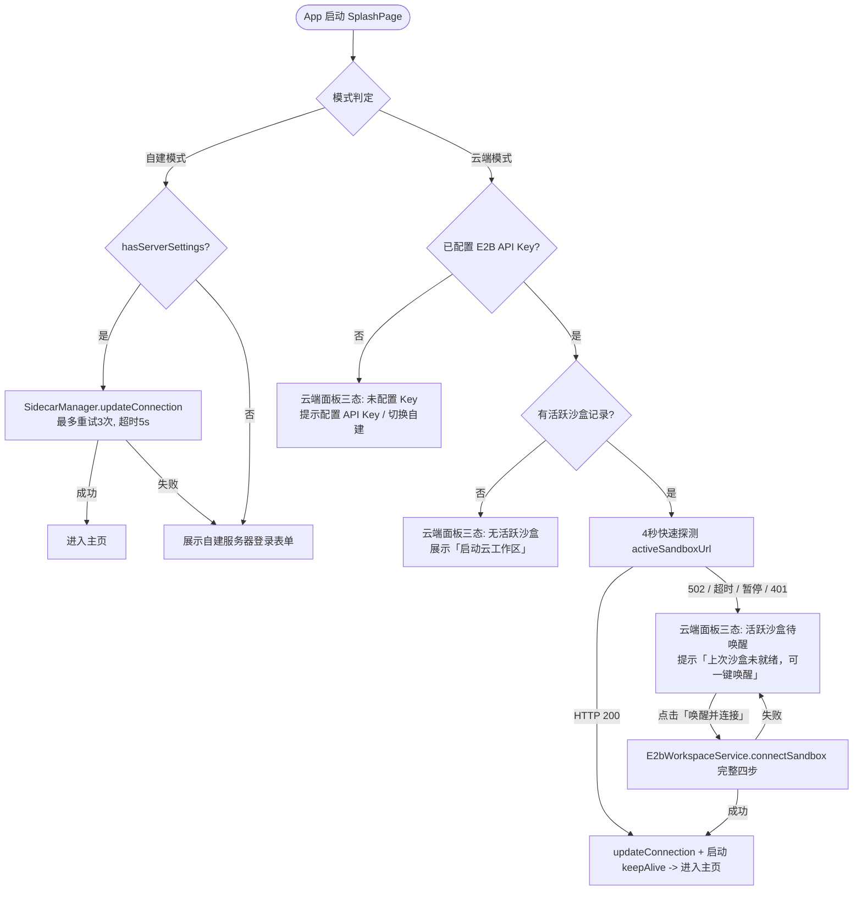

# OpenCode 登录与双后端连接设计文档

## 一、双后端架构概述

客户端同时支持两种后端连接模式：
1. **自建服务器 (Self-Hosted)**：通过 HTTP/HTTPS 直连用户自建的 `opencode serve` 实例（如本地电脑、局域网机器、WSL2 或独立 VPS）。
2. **E2B 云端沙盒 (E2B Cloud Workspace)**：基于 E2B 托管的 MicroVM Linux 沙盒，秒级拉起预装环境与 Git 仓库。

系统在启动页 (`SplashPage`)、连接设置页 (`OpencodeConnectionPage`)、项目列表与会话列表中统一提供直观的双模式支持与后端标识。

---

## 二、启动页（SplashPage）登录与冷启动恢复流

### 1. 模式初始化规则
- 若 `Global.serverUrl` 包含 `e2b.app`（由 `E2bWorkspaceService.isCloudUrl` 统一判定）或本地有活跃云端沙盒记录且无自建 URL，则初始选中 **E2B 云端模式**；
- 否则默认选中 **自建服务器模式**。
- 用户可在表单顶部通过 `SegmentedButton` 自由切换模式。

### 2. 云端模式 4 秒冷启动探测
- **目的**：替代盲目 17 秒轮询，避免应用冷启动时卡顿，且不触发非预期的沙盒唤醒与费用；
- **机制**：调用 `E2bWorkspaceService.instance.probeSandboxHealth` 发起 4 秒超时 GET `/api/health`：
  - **返回 200**：证明沙盒已在运行且密码正确，直接接入并进入主页，同时启动 TTL Keep-Alive；
  - **返回 502 / 暂停 / 超时 / 异常**：停止自动连接，停留在云端沙盒卡片，提示用户「上次沙盒未就绪，可一键唤醒并连接」；
  - 用户主动点击「唤醒并连接」后，方才触发完整的 `connectSandbox` 流程。

### 3. 云端面板三态
1. **未配 Key**：展示引导卡片与「配置 E2B API Key」按钮（拉起 `E2bApiKeyDialog`）及「切换至自建服务器」；
2. **有活跃沙盒**：展示沙盒信息（ID、脱敏 URL、状态），提供「连接上次沙盒 / 唤醒并连接」（主动作）、「新建沙盒」与「管理沙盒」（跳转连接页云端模式）；
3. **无活跃沙盒**：展示「启动云工作区」与「管理沙盒」。

---

## 三、共享连接流程下沉 (`E2bWorkspaceService.connectSandbox`)

为避免 `SplashPage` 与 `OpencodeConnectionPage` 存在冗余连接代码，核心沙盒接入逻辑下沉至 `E2bWorkspaceService.connectSandbox`，包含严格执行的四个步骤：

1. **真实 Sandbox.connect**：
   - 校验 API Key 与沙盒存在性；
   - E2B 控制面若检测到沙盒处于 paused 休眠状态，会自动唤醒（HTTP 201）；
   - 获取服务端最新签发的 `envdAccessToken`。
2. **密码解析与恢复**：
   - 优先使用本地存储密码（`activeSandboxPassword`）；
   - 若缺失，调用 `recoverPassword` 通过 `envd` 远程执行脚本从沙盒内读取 `~/.opencode_pw` 或从进程环境变量中提取；
   - 成功恢复后会写回本地配置，供后续冷启动探活使用。
3. **服务常驻与部署保障 (`ensureOpenCodeRunning`)**：
   - 先通过 local probe 检查沙盒 4096 端口是否已有匹配密码的健康服务；
   - 若无，在前台执行 `bootstrapScript`，自动安装缺失的 `opencode`、拉取 Git 代码并启动常驻 `opencode serve`。
4. **健康检查验证 (`waitForHealthy`)**：
   - 轮询沙盒外网端点 `/api/health` 与 `/global/health`；
   - 收到 401/403 密码错误快速失败，收到 200 确认就绪。

---

## 四、会话与项目列表后端标识

应用遵循单连接模型（同一时刻仅连接一个后端）。为了让用户在操作项目与会话时明确当前所属后端，UI 提供统一的图标语义：

| 位置 | E2B 云端沙盒 | 自建服务器 |
| :--- | :--- | :--- |
| **左抽屉项目列表** (`ProjectTile`) | `Icons.cloud_outlined` | `Icons.folder` |
| **右抽屉全部会话列表** (`SessionListPage`) | `Icons.cloud_outlined` | `Icons.dns_outlined` |
| **右侧栏已打开会话** (`RightDrawerSessionList`) | `Icons.cloud_outlined` | `Icons.dns_outlined` |
| **设置 Hub 连接项副标题** (`OpenCodeSettingsPage`) | `E2B 云端 · {shortId}` | `自建服务器 · {host}` |

判据统一由 `E2bWorkspaceService.isCloudUrl(Global.serverUrl)` 提供。连接切换时，通过 `Get.offNamed(AppRoutes.home)` 重构页面并重新拉取控制器状态，实现整页标识无缝同步。

---

## 五、生命周期与安全约定

1. **取消与序列号隔离**：
   - 启动页所有连接与探测操作均绑定 `_connectSeq` 和 `CancelToken`；
   - 用户点击切换模式、取消自动连接或进入配置面板时，立即废弃当前序列号并取消在途网络请求，杜绝竞态跳转。
2. **凭据安全与脱敏**：
   - 界面上展示的所有沙盒与服务器 URL 均经过 `maskUrl` 处理；
   - Basic Auth 密码落盘使用应用专属隔离存储（`AppSettingsStore`），沙盒内落盘权限严格限制为 `077`。
3. **配置回写遵循规范**：
   - 严格遵循 `AGENTS.md`：全局 `Global.server*` 仅在 `SidecarManager.updateConnection` 健康检查通过后写入，失败保留 last-known-good。
4. **自建与云端配置彻底隔离**：
   - 自建服务器表单参数独立保存在 `self_hosted_server_*` 键中，`Global.persistServerConnection` 仅在连接自建服务器（`!isCloudUrl`）时更新该配置；
   - 连接 E2B 云端沙盒时，仅更新运行时连接与 `cloud_workspace_config_v1`，绝不冲掉用户已保存的自建服务器 IP、端口及密码。切换模式时表单始终完整还原。
5. **跨后端项目与会话隔离**：
   - 连接切换时（`ProjectController.refreshAfterConnect`），清空旧后端的项目内存；
   - `fetchProjects()` 严格以当前后端返回的真实项目列表为准，禁止跨端合并 `localOnly` 幽灵项目；
   - `_restoreLastProject` 优先匹配当前后端的项目，未匹配时默认回退选中当前后端首个项目（如 `/home/user/workspace`），绝不将宿主机的 Windows 路径注入 Linux 沙盒容器；
   - 换后端时清空会话缓存（`SessionCacheStore.instance.clearAll()`），防止不同后端的历史会话被跨端误命中。
6. **配置弹窗响应式同步**：
   - `CloudWorkspaceSheet` 保存 Key 操作采用显式异步落盘与返回值回调；
   - 弹窗关闭后立即触发连接页的 `setState` 与沙盒列表拉取（`_fetchSandboxList`），实现无刷新延迟的即时视图切换。

